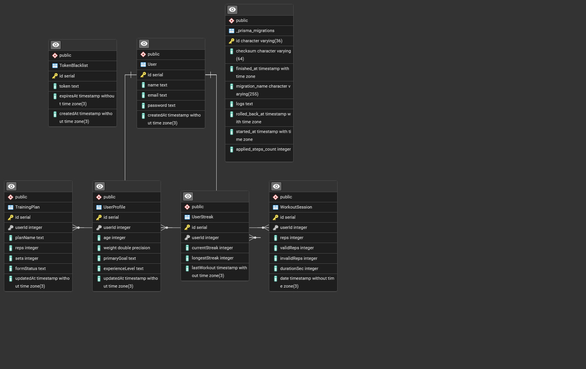

# AutoReps - AI-Powered Squat Exercise Correction System

<h1>File APK, Video Demo, dan AAB </h1>
https://drive.google.com/drive/folders/1CcU5COLbaIwcVtY3zqd8Hjcg6kjAjzdL?usp=sharing

## Daftar Isi
- [Pendahuluan](#pendahuluan)
- [Arsitektur Sistem](#arsitektur-sistem)
- [Entity Relationship Diagram (ERD)](#entity-relationship-diagram-erd)
- [System Flow](#system-flow)
- [Spesifikasi Backend](#spesifikasi-backend)
- [Spesifikasi Frontend](#spesifikasi-frontend)
- [Spesifikasi Model Machine Learning](#spesifikasi-model-machine-learning)
- [Instalasi dan Konfigurasi](#instalasi-dan-konfigurasi)
- [Teknologi yang Digunakan](#teknologi-yang-digunakan)

---

## Pendahuluan

**AutoReps** adalah aplikasi mobile berbasis AI yang dirancang untuk membantu pengguna melakukan latihan squat dengan form yang benar. Aplikasi ini menggunakan teknologi **pose estimation** dengan **Google ML Kit** dan **TensorFlow Lite** untuk mendeteksi posisi tubuh secara real-time, mengklasifikasikan fase gerakan squat (up/down), serta memberikan feedback tentang form yang benar atau salah.

### Fitur Utama:
- **Real-time Pose Detection**: Mendeteksi 33 titik pose tubuh menggunakan MediaPipe via Google ML Kit
- **Form Correction**: Memberikan feedback real-time tentang posisi kaki dan lutut
- **Automatic Rep Counting**: Menghitung repetisi valid dan invalid secara otomatis
- **Workout History**: Menyimpan riwayat latihan beserta statistik performa
- **Streak Tracking**: Memantau konsistensi latihan harian pengguna
- **Training Plan**: Menyusun rencana latihan yang dipersonalisasi

---

## Arsitektur Sistem

Sistem AutoReps menggunakan arsitektur **3-tier**:

```
┌─────────────────────────────────────────────────────────┐
│                    MOBILE APPLICATION                    │
│                   (Flutter - Dart)                       │
│  ┌──────────────────────────────────────────────────┐  │
│  │   Presentation Layer (UI)                        │  │
│  │   - Camera Preview + Pose Visualization          │  │
│  │   - Workout Statistics Dashboard                 │  │
│  │   - Training Plan Interface                      │  │
│  └──────────────────────────────────────────────────┘  │
│  ┌──────────────────────────────────────────────────┐  │
│  │   Business Logic Layer                           │  │
│  │   - SquatDetectorService (Form Analysis)         │  │
│  │   - State Machine (Rep Counting)                 │  │
│  │   - Repositories (Data Management)               │  │
│  └──────────────────────────────────────────────────┘  │
│  ┌──────────────────────────────────────────────────┐  │
│  │   On-Device ML Processing                        │  │
│  │   - Google ML Kit Pose Detection                 │  │
│  │   - TFLite Interpreter (squat_stage_mlp.tflite) │  │
│  └──────────────────────────────────────────────────┘  │
└─────────────────────────────────────────────────────────┘
                            ▼ HTTPS/REST API
┌─────────────────────────────────────────────────────────┐
│                    BACKEND SERVER                        │
│                  (Node.js + Express)                     │
│  ┌──────────────────────────────────────────────────┐  │
│  │   REST API Endpoints                             │  │
│  │   - Authentication (JWT)                         │  │
│  │   - Workout Session CRUD                         │  │
│  │   - Analytics & Statistics                       │  │
│  │   - User Profile Management                      │  │
│  └──────────────────────────────────────────────────┘  │
│  ┌──────────────────────────────────────────────────┐  │
│  │   Prisma ORM                                     │  │
│  └──────────────────────────────────────────────────┘  │
└─────────────────────────────────────────────────────────┘
                            ▼
┌─────────────────────────────────────────────────────────┐
│              DATABASE (PostgreSQL)                       │
│  - User, UserProfile, TrainingPlan                      │
│  - WorkoutSession, UserStreak                           │
└─────────────────────────────────────────────────────────┘
```

---

## Entity Relationship Diagram (ERD)



### Penjelasan Relasi:
- **User** ↔ **UserProfile**: One-to-One (setiap user memiliki satu profile)
- **User** ↔ **TrainingPlan**: One-to-One (setiap user memiliki satu rencana latihan aktif)
- **User** ↔ **UserStreak**: One-to-One (setiap user memiliki satu streak tracker)
- **User** ↔ **WorkoutSession**: One-to-Many (setiap user dapat memiliki banyak sesi workout)

---

## System Flow

### 1. Alur Autentikasi
```
┌──────┐     Register/Login      ┌─────────┐
│ User │ ──────────────────────> │ Backend │
└──────┘                          └─────────┘
   │                                   │
   │         Generate JWT Token        │
   │ <─────────────────────────────────┤
   │                                   │
   │     Store Token (SharedPrefs)     │
   └──>                                │
                                       │
   ┌────────────────────────────────────┘
   │ All subsequent API calls include:
   │ Authorization: Bearer <token>
   └─>
```

### 2. Alur Workout Session (Real-time Detection)
```
┌──────────┐
│ User Tap │
│  Start   │
└────┬─────┘
     │
     ▼
┌────────────────────┐
│ Countdown (3s)     │
└────┬───────────────┘
     │
     ▼
┌─────────────────────────────────────────────────────┐
│          CAMERA STREAM PROCESSING LOOP              │
│                                                     │
│  1. Capture CameraImage Frame                      │
│     ▼                                               │
│  2. Convert to InputImage                          │
│     ▼                                               │
│  3. Google ML Kit Pose Detection                   │
│     ├─> Extract 33 landmarks (x, y, z, confidence) │
│     └─> Check lower body visibility                │
│     ▼                                               │
│  4. Normalize landmarks (crop to center square)    │
│     ▼                                               │
│  5. TFLite Model Inference                         │
│     ├─> Input: 36 features (9 landmarks × 4)       │
│     └─> Output: [downProb, upProb]                 │
│     ▼                                               │
│  6. Form Analysis                                  │
│     ├─> Calculate shoulder_width                   │
│     ├─> Calculate feet_width                       │
│     ├─> Calculate knee_width                       │
│     ├─> feet_ratio = feet_w / shoulder_w           │
│     ├─> knee_ratio = knee_w / feet_w               │
│     ├─> Compare with thresholds                    │
│     └─> Determine: feet_status, knee_status        │
│     ▼                                               │
│  7. State Machine (Rep Counting)                   │
│     ├─> Current state: none / down / up            │
│     ├─> Transition: down → up (increment rep)      │
│     ├─> Validate: form_correct_flag                │
│     └─> Track: validReps, invalidReps              │
│     ▼                                               │
│  8. UI Update (setState)                           │
│     ├─> Display pose skeleton overlay              │
│     ├─> Show rep count                             │
│     └─> Show form feedback                         │
│                                                     │
│  Loop repeats @ ~30 FPS until user stops           │
└─────────────────────────────────────────────────────┘
     │
     ▼
┌──────────────┐
│  User Tap    │
│   Stop       │
└──────┬───────┘
       │
       ▼
┌───────────────────────────┐
│ POST /workout             │
│ {                         │
│   reps: totalReps,        │
│   validReps: validCount,  │
│   invalidReps: invalid,   │
│   durationSec: seconds    │
│ }                         │
└───────┬───────────────────┘
        │
        ▼
┌───────────────────────────┐
│ Backend saves to DB       │
└───────┬───────────────────┘
        │
        ▼
┌───────────────────────────┐
│ Show Workout Summary      │
└───────────────────────────┘
```

### 3. Logika Counting per Frame (Detail)

**Inti logika:**
```
UNTUK SETIAP FRAME:

1. Ambil landmarks:
   ls = LEFT_SHOULDER
   rs = RIGHT_SHOULDER
   lk = LEFT_KNEE
   rk = RIGHT_KNEE
   la = LEFT_ANKLE
   ra = RIGHT_ANKLE

2. Hitung jarak 2D (Euclidean):
   shoulder_w = dist_2d(ls, rs)
   feet_w = dist_2d(la, ra)
   knee_w = dist_2d(lk, rk)

3. Hitung rasio:
   feet_ratio = feet_w / shoulder_w
   knee_ratio = knee_w / feet_w

4. Bandingkan dengan threshold:
   IF feet_ratio < feet_ratio_min → feet_status = 'too_close'
   ELSE IF feet_ratio > feet_ratio_max → feet_status = 'too_wide'
   ELSE → feet_status = 'correct'

   IF knee_ratio < knee_ratio_min → knee_status = 'caving_in'
   ELSE IF knee_ratio > knee_ratio_max → knee_status = 'too_wide'
   ELSE → knee_status = 'correct'

5. Tentukan form flag:
   IF (feet_status == 'correct' AND knee_status == 'correct'):
       form_correct_flag = True
   ELSE:
       form_correct_flag = False
       hadIncorrectFormThisRep = True

6. State Machine:
   IF currentState == 'none' AND modelPrediction == 'down':
       currentState = 'down'
   
   ELSE IF currentState == 'down' AND modelPrediction == 'up':
       repCount += 1
       IF hadIncorrectFormThisRep:
           invalidRepCount += 1
       currentState = 'up'
       hadIncorrectFormThisRep = False
   
   ELSE IF currentState == 'up' AND modelPrediction == 'down':
       currentState = 'down'

7. Syarat counting:
   - Lower body HARUS terlihat (confidence ≥ 0.5)
   - Ada transisi down → up
   - Rep hanya valid jika form_correct_flag == True selama seluruh gerakan
```

---

## Spesifikasi Backend

### Tech Stack
- **Runtime**: Node.js (Express.js v5.1.0)
- **ORM**: Prisma v6.18.0
- **Database**: PostgreSQL
- **Authentication**: JWT (jsonwebtoken v9.0.2)
- **Password Hashing**: bcrypt v6.0.0
- **CORS**: cors v2.8.5

### API Endpoints

#### 1. Authentication (`/auth`)
| Method | Endpoint | Auth Required | Request Body | Response |
|--------|----------|---------------|--------------|----------|
| POST | `/auth/register` | ❌ | `{ name, email, password }` | `{ id, name, email, createdAt }` |
| POST | `/auth/login` | ❌ | `{ email, password }` | `{ token, user }` |

**Implementasi JWT:**
```javascript
// Middleware auth.js
const token = req.headers.authorization?.split(" ")[1];
const decoded = jwt.verify(token, process.env.JWT_SECRET);
req.user = decoded; // { id, email }
```

#### 2. User Profile (`/user`)
| Method | Endpoint | Auth Required | Request Body | Response |
|--------|----------|---------------|--------------|----------|
| GET | `/user/profile` | ✅ | - | `UserProfile` object |
| POST | `/user/profile` | ✅ | `{ age, weight, primaryGoal, experienceLevel }` | Updated profile |

#### 3. Training Plan (`/plan`)
| Method | Endpoint | Auth Required | Request Body | Response |
|--------|----------|---------------|--------------|----------|
| GET | `/plan` | ✅ | - | `TrainingPlan` object |
| POST | `/plan` | ✅ | `{ planName, reps, sets, formStatus }` | Updated plan |

#### 4. Workout Session (`/workout`)
| Method | Endpoint | Auth Required | Request Body | Response |
|--------|----------|---------------|--------------|----------|
| POST | `/workout` | ✅ | `{ reps, validReps, invalidReps, durationSec }` | Created session |
| GET | `/workout` | ✅ | - | Array of `WorkoutSession` |

#### 5. Analytics (`/analytics`)
| Method | Endpoint | Auth Required | Response |
|--------|----------|---------------|----------|
| GET | `/analytics/summary` | ✅ | `{ total_reps, total_sessions }` |
| GET | `/analytics/weekly` | ✅ | Array of `{ day, reps }` (last 7 days) |

## Spesifikasi Frontend

### Tech Stack
- **Framework**: Flutter 3.9.2 (Dart SDK)
- **State Management**: setState (StatefulWidget)
- **HTTP Client**: http v1.2.0
- **Local Storage**: shared_preferences v2.2.2
- **Camera**: camera v0.11.3
- **ML Libraries**:
  - google_mlkit_pose_detection v0.12.0
  - tflite_flutter v0.11.0
- **Image Processing**: image v4.0.0

### Komponen Utama

#### 1. SquatDetectorService (Core ML Service)
**File**: `lib/features/record/data/squat_detector_service.dart`

**Responsibilities:**
- Inisialisasi Google ML Kit Pose Detector
- Load TFLite model (squat_stage_mlp.tflite)
- Load thresholds (squat_thresholds.json)
- Proses frame-by-frame dari camera stream
- Form validation (feet & knee position)
- Rep counting dengan state machine

#### 2. Camera Page
**File**: `lib/features/record/presentation/cam.dart`

**Responsibilities:**
- Mengelola CameraController
- Memulai/menghentikan image stream
- Countdown sebelum workout dimulai
- Menampilkan pose overlay (via PosePainter)
- Menampilkan feedback form real-time
- Menyimpan workout session ke backend


### Assets yang Dibutuhkan
```yaml
assets:
  - assets/models/squat_stage_mlp.tflite
  - assets/models/squat_thresholds.json
  - assets/models/meta.json
  - assets/images/
```

**squat_thresholds.json:**
```json
{
  "feet_ratio_min": 0.4134821597055335,
  "feet_ratio_max": 1.564659821058367,
  "knee_ratio_min": 0.6782825087970797,
  "knee_ratio_max": 1.8640124560918636
}
```

---

## Spesifikasi Model Machine Learning

### Model Architecture: Multi-Layer Perceptron (MLP)

Model ini adalah **classifier** yang mengklasifikasikan fase gerakan squat berdasarkan fitur pose numerik (bukan dari gambar langsung).

#### Arsitektur Lengkap
```
Input Layer (36 features)
    ├─> 9 landmarks × 4 features (x, y, z, likelihood)
    │   Landmarks: nose, leftShoulder, rightShoulder,
    │              leftHip, rightHip, leftKnee, rightKnee,
    │              leftAnkle, rightAnkle
    │
    ▼
Dense Layer 1: 64 neurons, ReLU activation
    ├─> Menangkap pola awal dari fitur pose
    ├─> ReLU mencegah vanishing gradient
    │
    ▼
Dropout Layer 1: 25%
    ├─> Regularisasi untuk mencegah overfitting
    ├─> Menonaktifkan 25% neuron secara random saat training
    │
    ▼
Dense Layer 2: 32 neurons, ReLU activation
    ├─> Kompresi informasi (64 → 32 fitur penting)
    ├─> Fokus pada pola paling relevan untuk klasifikasi
    ├─> Membuat model lebih ringan untuk mobile inference
    │
    ▼
Dropout Layer 2: 25%
    ├─> Regularisasi tambahan
    ├─> Memastikan model tidak bergantung pada neuron tertentu
    │
    ▼
Output Layer: 2 neurons, Softmax activation
    ├─> Output: [prob_down, prob_up]
    └─> Softmax memastikan total probabilitas = 1.0
```

### Training Pipeline

#### 1. Data Preparation
**Input**: CSV file dengan kolom:
- 33 landmarks × 4 features = 132 kolom numerik
- 1 kolom label (0 = down, 1 = up)

**Preprocessing:**
```python
# Feature extraction: pilih 9 landmarks penting saja
SELECTED_LANDMARKS = [
    "nose", "left_shoulder", "right_shoulder",
    "left_hip", "right_hip", "left_knee", "right_knee",
    "left_ankle", "right_ankle"
]

# Normalisasi koordinat
# - x, y dinormalisasi ke [0, 1] berdasarkan ukuran image
# - z (depth) dinormalisasi ke range tertentu
# - likelihood sudah dalam range [0, 1]

# Train/Test split
X_train, X_test, y_train, y_test = train_test_split(
    X, y, test_size=0.2, stratify=y, random_state=42
)
```

#### 2. Training Configuration
```python
model.fit(
    X_train, y_train,
    validation_data=(X_test, y_test),
    batch_size=32,
    epochs=50,
    callbacks=[
        keras.callbacks.EarlyStopping(
            monitor="val_loss",
            patience=10,
            restore_best_weights=True
        )
    ]
)
```

#### 3. Conversion to TFLite
```python
# Convert Keras model to TFLite
converter = tf.lite.TFLiteConverter.from_keras_model(model)
converter.optimizations = [tf.lite.Optimize.DEFAULT]
tflite_model = converter.convert()

# Save to file
with open("squat_stage_mlp.tflite", "wb") as f:
    f.write(tflite_model)
```

**Key Points:**
- Rep hanya dihitung saat transisi `down → up`
- Lower body **HARUS** terlihat dengan confidence ≥ 0.5
- Invalid rep tercatat jika form sempat salah selama satu cycle (down → up)
- Form flag di-reset setiap kali mulai rep baru (state = 'down')

### Model Performance Metrics

**Expected Performance:**
- **Accuracy**: > 90% pada test set
- **Inference Time**: < 10ms per frame (on-device)
- **Model Size**: ~50 KB (TFLite)
- **F1-Score**: > 0.88 untuk kedua kelas (down/up)

---

## Instalasi dan Konfigurasi

### Prerequisites
- **Node.js** ≥ 18.x
- **PostgreSQL** ≥ 14.x
- **Flutter** ≥ 3.9.2
- **Android SDK** / **Xcode** (untuk build mobile)
- **Python** 3.8+ (untuk training model, optional)

### Setup Backend

1. **Install dependencies:**
```bash
cd backend
npm install
```

2. **Configure environment:**
```bash
cp .env.example .env
# Edit .env dengan DATABASE_URL dan JWT_SECRET yang sesuai
```

3. **Setup database:**
```bash
npm run migrate      # Run Prisma migrations
npm run generate     # Generate Prisma client
npm run studio       # (Optional) Open Prisma Studio
```

4. **Run development server:**
```bash
npm run dev          # Runs on port 3000
```

### Setup Frontend

1. **Install dependencies:**
```bash
cd frontend
flutter pub get
```

2. **Configure API endpoint:**
Edit `lib/core/config/api_config.dart`:
```dart
class ApiConfig {
  static const String baseUrl = 'http://YOUR_BACKEND_IP:3000';
  // Use 10.0.2.2 for Android emulator
  // Use localhost for iOS simulator
}
```

3. **Place TFLite model & thresholds:**
Pastikan file berikut ada di folder `assets/models/`:
- `squat_stage_mlp.tflite`
- `squat_thresholds.json`
- `meta.json`

4. **Run app:**
```bash
flutter run          # Pilih device/emulator
flutter build apk    # Build APK untuk Android
flutter build ios    # Build untuk iOS
```

### Training Model (Optional)

1. **Install Python dependencies:**
```bash
cd core
pip install -r requirements.txt
```

2. **Prepare training data:**
Place CSV files in:
- `core/squat_model/train.csv`

3. **Train model:**
```bash
python train_plank_squat_models.py
```

Output:
- `core/squat_model/model/squat_stage_mlp.h5`
- `core/squat_model/model/squat_stage_mlp.tflite`
- `core/squat_model/model/squat_thresholds.json`
- `core/squat_model/model/meta.json`

4. **Copy ke Flutter assets:**
```bash
cp core/squat_model/model/*.tflite frontend/assets/models/
cp core/squat_model/model/squat_thresholds.json frontend/assets/models/
```

---

## Teknologi yang Digunakan

### Backend
| Teknologi | Versi | Fungsi |
|-----------|-------|--------|
| Node.js | 18+ | Runtime JavaScript server-side |
| Express.js | 5.1.0 | Web framework untuk REST API |
| Prisma | 6.18.0 | ORM untuk database operations |
| PostgreSQL | 14+ | Relational database |
| JWT | 9.0.2 | Token-based authentication |
| bcrypt | 6.0.0 | Password hashing |

### Frontend
| Teknologi | Versi | Fungsi |
|-----------|-------|--------|
| Flutter | 3.9.2 | Cross-platform mobile framework |
| Dart | 3.9.2 | Programming language |
| camera | 0.11.3 | Camera access & image stream |
| google_mlkit_pose_detection | 0.12.0 | MediaPipe pose estimation |
| tflite_flutter | 0.11.0 | TensorFlow Lite interpreter |
| http | 1.2.0 | HTTP client untuk REST API |
| shared_preferences | 2.2.2 | Local storage (token, settings) |

### Machine Learning
| Teknologi | Versi | Fungsi |
|-----------|-------|--------|
| TensorFlow | 2.x | Deep learning framework |
| Keras | 2.x | High-level neural network API |
| MediaPipe | - | Pose estimation library (via ML Kit) |
| Python | 3.8+ | Model training & conversion |
| NumPy | - | Numerical operations |
| Pandas | - | Data manipulation |
| Scikit-learn | - | Train/test split, metrics |

---

## Kesimpulan

**AutoReps** adalah sistem end-to-end yang mengintegrasikan:
1. **Real-time Computer Vision**: Pose detection dengan Google ML Kit (33 keypoints)
2. **Machine Learning Classification**: MLP model untuk klasifikasi fase squat (up/down)
3. **Rule-based Form Validation**: Threshold-based analysis untuk feet & knee positioning
4. **State Machine Logic**: Counter dengan validasi form per-rep
5. **RESTful Backend**: Node.js + Express + PostgreSQL untuk data persistence
6. **Cross-platform Mobile App**: Flutter untuk Android & iOS

Sistem ini memberikan feedback **instant** kepada pengguna tentang form squat mereka, menghitung repetisi secara otomatis, dan menyimpan history workout untuk tracking progress jangka panjang.

---

## Lisensi
© 2025 AutoReps Team. All rights reserved.
